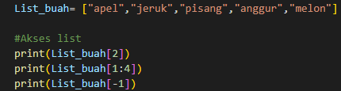
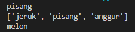
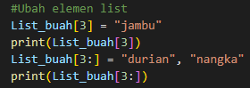
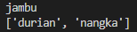
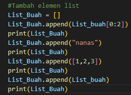
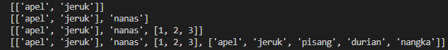
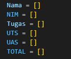
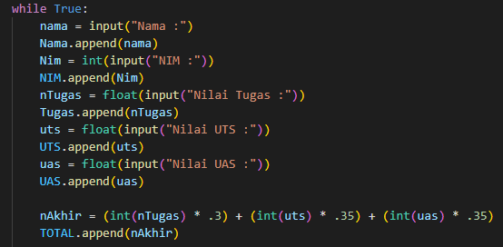
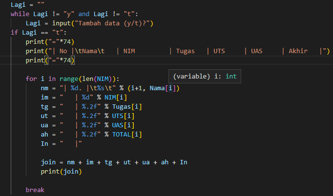
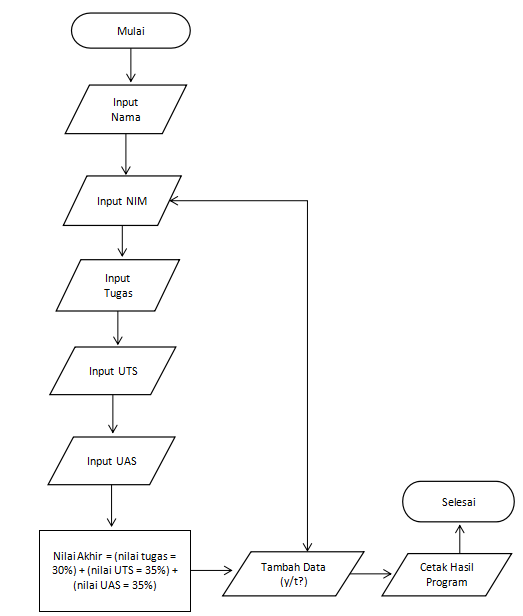

# Proses / Langkah-Langkah PRAKTIKUM 5

## Latihan 5
### Buatlah Sebuah List Sebanyak 5 Element Dengan Nilai Bebas

### Akses List
1.Tampilkan element 3

2.Tampilkan element 2 sampai 4

3.Tampilkan element terakhir

### Ubah Elemen List
1.Ubah element 4 dengan element lainnya

2.Ubah element 4 dengan element terakhir

### Tambah Element List
1.Tampilkan 2 bagian dari list pertama dan jadikan list kedua 

2.Tambahkan list kedua dengan string

3.Tambahkan list kedua dengan nilai 3

4.Gabungkan list pertama dengan list kedua

## Tugas Praktikum 5
### Program Sederhana Untuk Menambahkan Data Kedalam Sebuah List
1.Program meminta memasukkan data sebanyak-banyaknya (gunakan perulangan)

2.Tampilkan pertanyaan untuk menambahkan data (y/t?), apabila jawaban t, maka program akan menampilkan daftar namanya

3.Nilai akhir diambil dari perhitungan 3 komponen nilai (tugas: 30%, uts:35%, uas:35%)
### Langkah-Langkah
1.Buatlah data list kosong seperti pada gambar dibawah ini :

2.Setelah itu gunakan variabel "while True" dan "append" seperti pada gambar dibawah ini :

3.Untuk perulangan agar data dapat dijalankan berkali-kali, masukkan program (y/t?) berikut ini :

4.Hasil dari program yang dibuat akan seperti ini :

## Flowchart Praktikum 5

